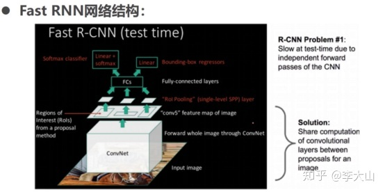
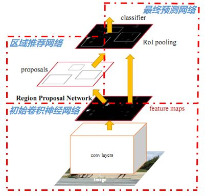
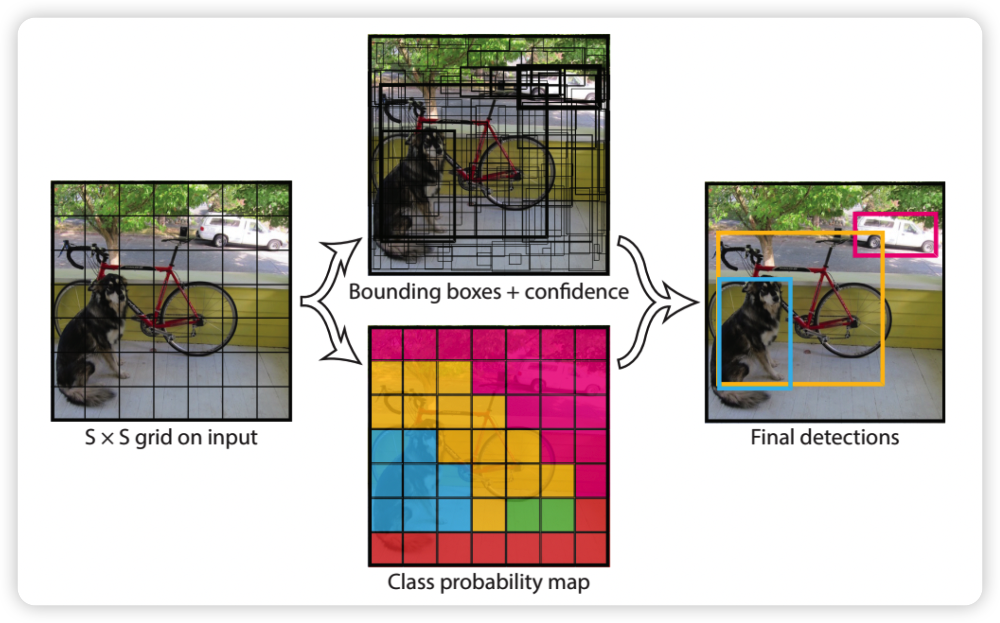
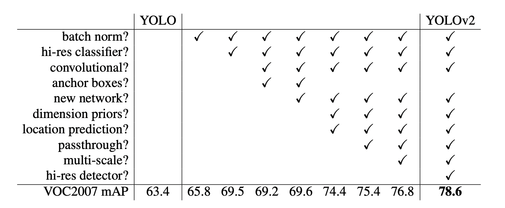
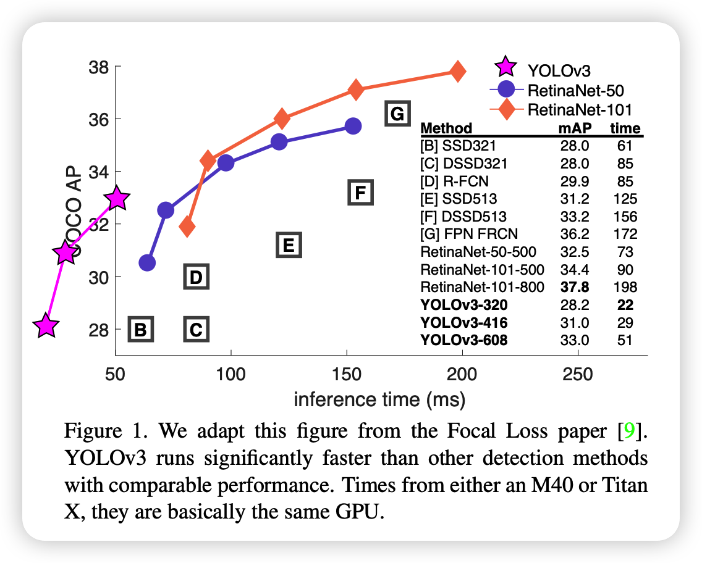
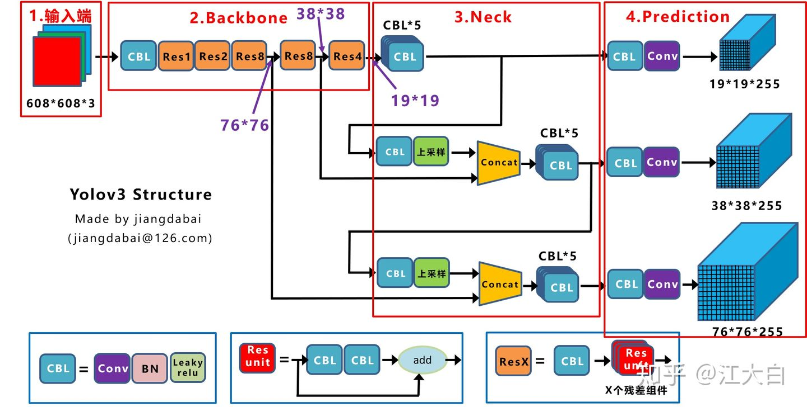
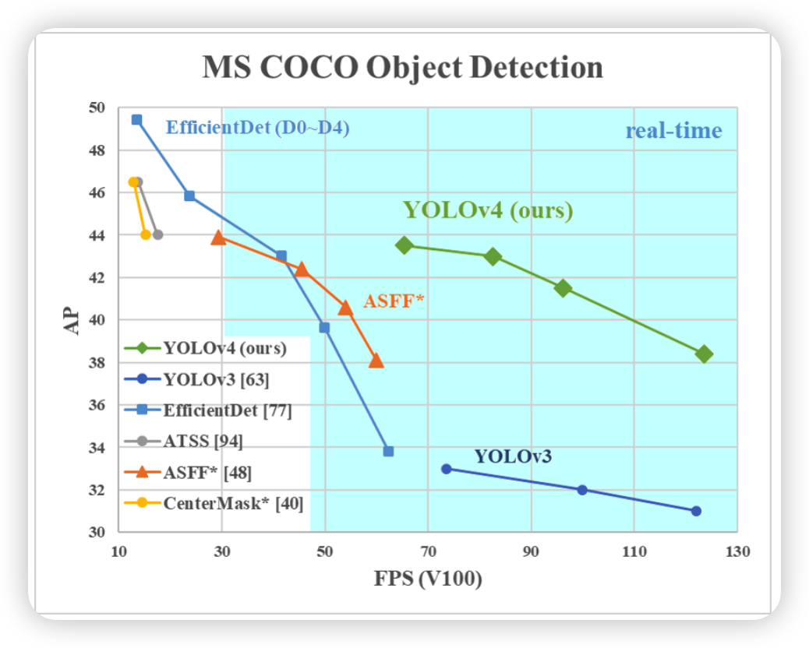
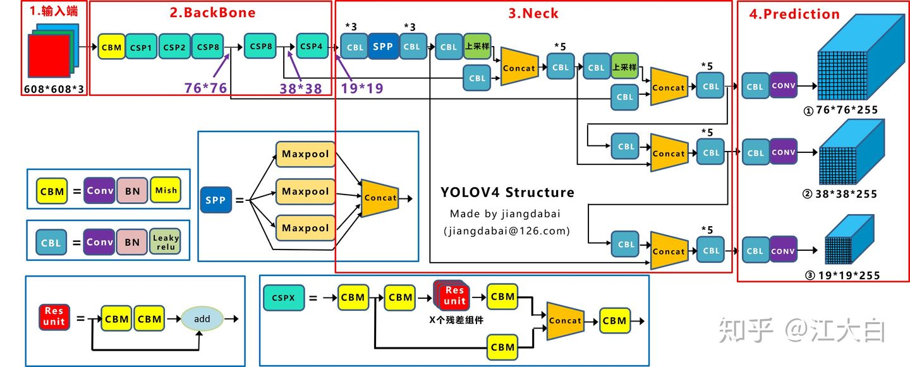
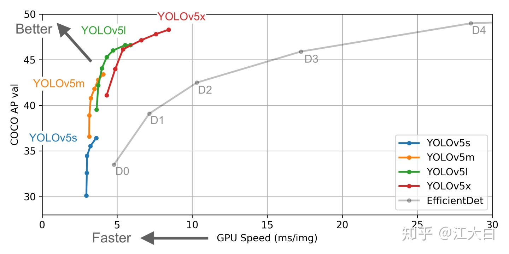
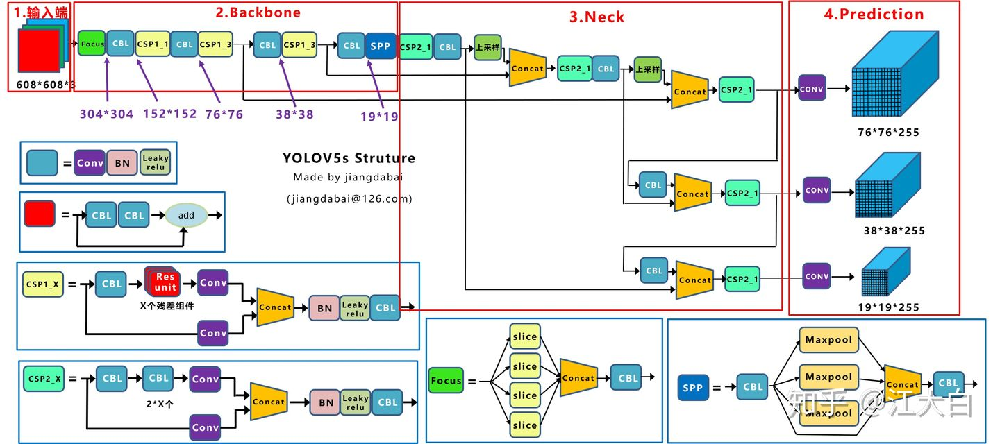

[toc]
# 目标检测算法简介
## 目标检测问题概况
### 定义
目标检测的任务是对画面中的目标进行**定位**和**分类**。定位是指回归目标的矩形框，分类是指对目标框进行类别区分。
### 主要问题
目标检测任务主要解决以下几个问题：**目标的种类和数量**、**目标的尺寸**、**外界的干扰因素**、**特定场景任务**等；
## 目标检测算法方法概况
目标检测算法可以分为**传统目标检测算法**和**基于深度学习的目标检测算法**。其中传统的目标检测算法的主要工作集中在手工设计中低层面的特征提取算法，如**SIFT**、**HOG**特征等；基于深度学习的目标检测算法的主要功能是通过网络的设计，结合数据和loss的使用，使特征提取这个工作智能化，并将整个目标检测任务简单化。近些年随着计算领域的突破和深度学习算法架构的突破，基于深度学习的算法性能大大优于传统的方法，传统的算法已经渐渐退出历史舞台了。不过很多深度学习的方法也是基于传统算法的思路去做实现的，接下来文章会给大家介绍传统算法和深度学习算法的发展过程，让大家对目标检测算法有个大致的概念。
# 传统目标检测算法

## 传统目标检测算法架构
  
**候选框提取**：  
	通过算法，选取目标候选框；**滑动窗口**、**SS算法**等；
**特征提取**：  
	手工设计算法，提取低层特征（纹理、色彩等）、中层特征和高层语义特征，传统方法的主要工作都集中在低层和中层特征提取的算法设计上；**VJ**、**HOG特征**等；  
**分类器**：  
	对每一个候选框进行分类；**SVM**等； 
**NMS非极大值抑制**：  
	1、将所有的框按类别划分，并剔除背景类，因为无需NMS；  
	2、对每个物体类中的边界框(B_BOX)，按照分类置信度降序排列；  
	3、在某一类中，选择置信度最高的边界框B_BOX1，将B_BOX1从输入列表中去除，并加入输出列表；  
	4、逐个计算B_BOX1与其余B_BOX2的交并比IoU，若IoU(B_BOX1,B_BOX2) > 阈值TH，则在输入去除B_BOX2；  
	5、重复步骤3到4，直到输入列表为空，完成一个物体类的遍历；  
	6、重复2到5，直到所有物体类的NMS处理完成； 
	7、输出列表，算法结束；  
# 基于深度学习的目标检测算法
## 深度学习目标检测算法简介
目前基于深度学习的目标算法技术方向可以分为**基于anchor base**和**基于anchor free**的方法。anchor base和anchor free 的区别在于，有没有使用anchor来提取候选框。其中基于anchor base的技术路线中又可以分为two-stage和one-stage的方法。本章节会以RCNN系列网络为例介绍two-stage方法，以YOLO系列网络为例介绍one-stage方法、以CornerNet、ExtremeNet、CenterNet、FCOS为代表介绍anchor free 网络以及基于视频的目标检测网络。
## 基于anchor base的目标检测算法
### 基于two-stage的深度学习目标检测算法
#### RCNN系列
RCNN系列网络是two-stage网络的经典之作，其中RCNN网络首次将CNN网络引入目标检测领域，是CNN在目标检测领域的开山之作。下图是RCNN迭代示意图：

##### [RCNN](https://arxiv.org/pdf/1311.2524v5.pdf)

**网络流程**   
候选区域生成：一张图像生成1K~2K个候选区域 （采用Selective Search 方法）  
特征提取：对每个候选区域，使用深度卷积网络提取特征 （CNN）  
类别判断：特征送入每一类的SVM 分类器，判别是否属于该类  
位置精修：使用回归器精细修正候选框位置  

**优点**  
	ss算法比滑动窗口更高效、精度更高；  
**缺点**  
	1、ss算法还是很耗时；  
	2、四个模块基本是单独训练的，CNN使用预训练模型finetune、SVM重头训练、边框回归重头训练、微调困难；  
##### Fast RCNN

fast-rcnn的步骤如下:  
step1: 同样是寻找一个在imagenet上训练过的预训练cnn模型(VGG16)；  
step2: 与rcnn一样，通过selective search在图片中提取2000个候选区域；  
step3: 将一整个图片都输入cnn模型中，提取到图片的整体特征(共享卷积特征)；  
step4: 把候选区域映射到上一步cnn模型提取到的feature map里；  
step5: 采用rol pooling层对每个候选区域的特征进行上采样,从而得到固定大小的feature map；  
step6: 根据softmax loss和smooth l1 loss对候选区域的特征进行分类和回归调整的过程；  

**优点**  
1、共享卷机特征，大大提升了候选框特征提取效率；    
2、把分类分类和回归任务一起输出；  

**缺点**  
1、候选框提取ss算法还是太耗时了； 

##### Faster RCNN

**改进点**   
1、提出RPN网络取代SS算法；

**优点**  
1、网络精度高；  
2、RPN网络速度明显快于SS算法；  
3、实现了真正的端到端的训练；  

**缺点**  
相比较one stage算法，速度慢，无法做到实时；  

### 基于one-stage的深度学习目标检测算法
#### YOLO系列
YOLO系列算法出自Joseph Redmon之手，可以说是one-stage目标检测算法的奠基之作。YOLO全称you only look once，意思是把将类别分类和框回归的任务进行统一。从YOLO 到YOLOv3，作者完成了YOLO系列网络的基础框架搭建，后续的网络大部分（YOLOv4、YOLOv5、YOLObile和YOLOX等等）都是基于YOLOv3的网络做的一些修改。作者Joseph Redmon在2020年2月，在推文上宣布退出了CV领域（原因是军方邀请他观看了YOLOv3在军事无人机上的应用，作者认为这有违他的初衷）。在作者宣布退出CV界之后的4月23号和6月25号，YOLOv4和YOLOv5相续发表。

##### [YOLO](https://arxiv.org/pdf/1506.02640.pdf)

**算法流程**  
1、把原图分成7✖️7的格子；  
2、每个格子有2个候选框，但是只负责预测一个目标（框执行度以及每个类别的分数）；  
3、再对7✖️7✖️2个格子，通过阈值删除置信度低的框，再使用NMS算法删除冗余框；  

**优点**  
1、速度快；  
2、背景误检率低；  
3、通用能力强；  
**缺点**  
1、对小目标和密集目标检测能力差；  
2、召回率低；  
3、对边框的定位不够精准；  

##### [YOLO9000](https://arxiv.org/pdf/1612.08242.pdf)
YOLO9000就是YOLOv2网络，在YOLO系列网络中起着承上启下的作用。下表是论文中列出的改进点以及每个改进点的提升：
截屏2022-04-01 上午12.10.43
**改进点**
1、增加了BN层；
2、使用高分辨率的分类器；
3、使用先验的anchor尺寸；
4、使用聚类的方式获取anchor的尺寸；
5、约束anchor的中心点位置；
6、提出passthrough层，增加细粒度特征；
7、使用多尺度的输入训练；
8、提出Darnet-19网络；
9、提出WordTree结构，支持9K+目标；

**优点**
1、大幅度提升了精度；
2、大幅度提升了检测的目标数量；

##### [YOLOv3](https://pjreddie.com/media/files/papers/YOLOv3.pdf)

	YOLOv3是一篇不是严格意义上的学术论文，而是一篇技术报告。作者是因为需要在另外一篇文章中需要引用YOLOv3，临时写的一篇报告。所以在描述和结果对比上表达得很随意。如上图，源自YOLOv3原文开头，作者把YOLOv3的结果画到了坐标轴的外面，以此来表明YOLOv3的结果明显优于比当的前SOTA网络RetinaNet（有装逼的嫌疑，也可能是作者直接取了RetinaNet论文的图，不想再重新绘制，直接在上面添加了YOLOv3的结果）。但是不管怎么样，YOLOv3基本上奠定了YOLO系列检测网络的基本框架，后续的改进都是基于这个框架增加一些当前work的方法进去。

**改进点**  
	1、多尺度预测 （引入FPN）；  
	2、更好的基础分类网络（darknet-53, 类似于ResNet引入残差结构）；  
	3、分类器不在使用Softmax，分类损失采用binary cross-entropy loss（二分类交叉损失熵）  

**优点**  
1、提升了检测精度；  
2、多尺度预测大幅提升了检测目标数（8K+）和小目标检测能力；  

##### [YOLOv4](https://arxiv.org/pdf/2004.10934.pdf)

YOLOv4像一篇目标检测网络的tricks文献综述，作者把目标检测领域当时work的方法基本都用试了一遍，可见作者的“炼丹”水平。YOLOv4网络在保持和YOLOv3相同速度的情况下大幅提升了网络的精度。

**改进点**  
1、相较于YOLO V3的DarkNet53，YOLO V4用了CSPDarkNet53  
2、相较于YOLO V3的FPN,YOLO V4用了SPP+PAN  
3、CutMix数据增强和马赛克（Mosaic）数据增强  
4、DropBlock正则化  
5、等等  

**优点**  
1、相同速度下大幅提升了网络精度；  

##### YOLOv5

YOLOv5主要是针对工程化做了一系列的优化。相比YOLOv4在同精度的情况下，速度由原来的50FPS达到了140FPS，这对工业界来说是很有意义的。

**改进点**
1、使用Pytorch框架，对用户非常友好，能够方便地训练自己的数据集，相对于YOLO V4采用的Darknet框架，Pytorch框架更容易投入生产。
2、代码易读，整合了大量的计算机视觉技术，非常有利于学习和借鉴。
3、不仅易于配置环境，模型训练也非常快速，并且批处理推理产生实时结果。
4、能够直接对单个图像，批处理图像，视频甚至网络摄像头端口输入进行有效推理。
5、能够轻松的将Pytorch权重文件转化为安卓使用的ONXX格式，然后可以转换为OPENCV的使用格式，或者通过CoreML转化为IOS格式，直接部署到手机应用端。
6、最后YOLO V5s高达140FPS的对象识别速度令人印象非常深刻，使用体验非常棒。

**优点**
1、速度快；
2、工程化部署便捷；

#### SSD系列
后续更新
## 基于anchor free的目标检测算法
后续更新
## 基于视频的目标检测算法
后续更新
### 双流网络
### 3DConv网络
### CNN+LSTM网络
### 图卷积网络
# 目标检测算法评价指标

